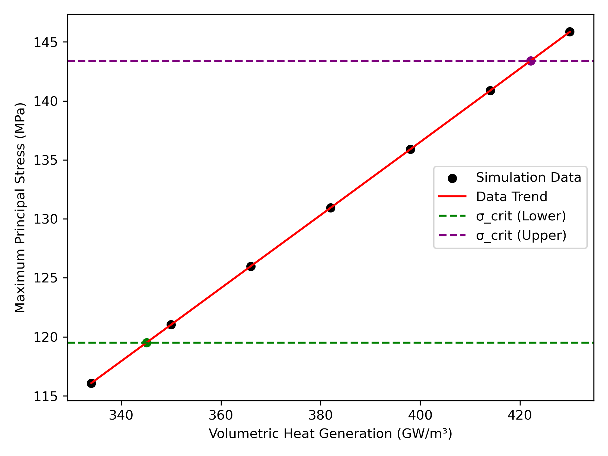
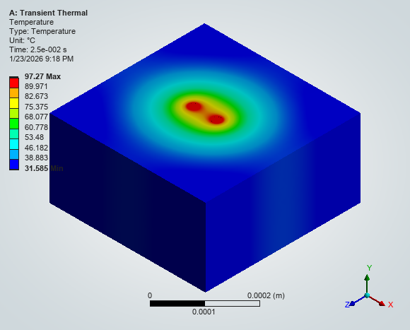

# Phase 2 – Thermal Loading Sensitivity Study (2-Via Baseline)

---

## 1. Objective

Phase 1 identified the dual-via configuration as the most structurally stable case under 1 W RF excitation.

In this phase, the 2-via configuration is fixed and volumetric heat generation (q‴) is systematically increased to evaluate thermal robustness and structural sensitivity.

This analysis investigates how increasing thermal loading affects temperature rise and maximum principal stress.

---

## 2. Heat Sweep Setup

- Geometry: 2-via configuration
- Mesh and boundary conditions: identical to Phase 1
- Volumetric heat generation increment: 16 GW/m³
- Sweep range: 334 – 430 GW/m³

All other parameters remain unchanged to isolate the effect of thermal loading.

---

## 3. Simulation Results

| q‴ (GW/m³) | Max Temperature (°C) | Max Principal Stress (MPa) |
|------------|----------------------|----------------------------|
| 334 | 80.456 | 116.08 |
| 350 | 83.266 | 121.03 |
| 366 | 86.067 | 125.99 |
| 382 | 88.868 | 130.94 |
| 398 | 91.668 | 135.90 |
| 414 | 94.469 | 140.87 |
| 430 | 97.270 | 145.86 |

---

### Trend Visualization

The results show a strong linear relationship between volumetric heat generation and both temperature rise and principal stress.

---

## 4. Observed Trend

### Temperature Response

Temperature increases approximately linearly with volumetric heat generation.

Each 16 GW/m³ increase results in ~2.8 °C temperature rise.

This indicates stable thermal scaling without abrupt nonlinear behavior.

---

### Structural Response

Maximum principal stress also increases almost linearly with heat generation.

Each 16 GW/m³ increment results in ~4.9–5 MPa increase in σ₁.

This confirms that thermo-mechanical stress is directly driven by thermal expansion mismatch.

---

### Representative Contours

Low heat (334 GW/m³):

High heat (430 GW/m³):

These representative cases illustrate the spatial amplification of tensile stress as thermal loading increases.

---

## 5. Physical Interpretation

Because copper has a significantly higher CTE than glass, increasing temperature amplifies thermal expansion mismatch.

σ₁ ∝ ΔT ∝ q‴

Thus, volumetric heat generation directly controls fracture-driving tensile stress at the via–glass interface.

---

## 6. Engineering Implication

The linear relationship between q‴ and σ₁ enables predictive estimation of fracture risk.

This provides a controllable design parameter:

Thermal loading → stress → crack risk

The 2-via configuration remains structurally efficient, but excessive thermal loading may still drive the system toward fracture threshold.
